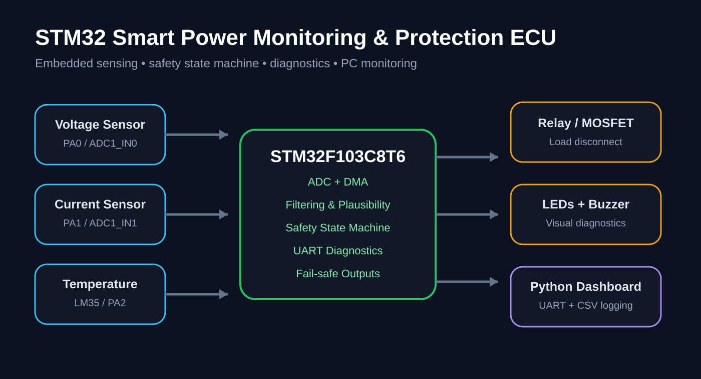
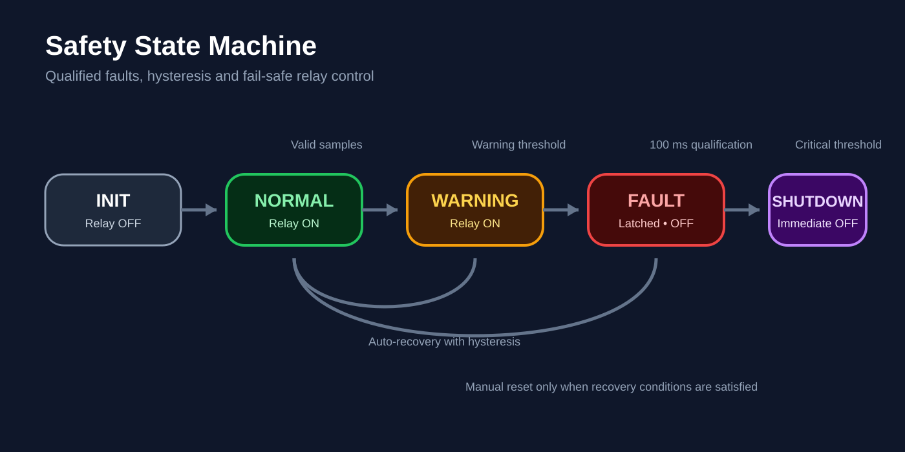
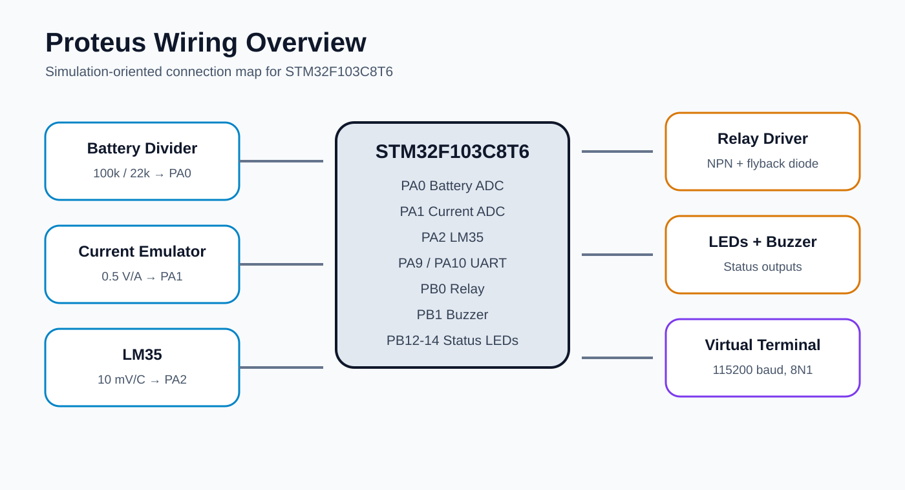

# ECU STM32 de surveillance et de protection de puissance

[🇬🇧 English](README.md) | 🇫🇷 **Français**



Système embarqué de surveillance et de protection électrique basé sur le STM32F103C8T6. Le projet mesure la tension batterie, le courant de charge et la température, détecte les conditions anormales, commande un relais de sécurité, transmet les diagnostics par UART et fournit un tableau de bord Python pour la supervision sur PC.

## Fonctionnalités principales

- Microcontrôleur STM32F103C8T6 / Blue Pill
- Acquisition ADC sur 3 canaux avec DMA
- Mesure de la tension batterie, du courant et de la température avec LM35
- Filtrage passe-bas du premier ordre
- Machine d'états de sûreté : INIT, NORMAL, WARNING, FAULT, SHUTDOWN
- Qualification temporelle des défauts et hystérésis
- Relais en configuration fail-safe, LEDs d'état et buzzer
- Télémétrie UART à 115200 bauds
- Dashboard Python avec communication série et journalisation CSV
- Documentation pour la simulation sous Proteus
- Exigences, DTC et matrice de tests de vérification
- Évolutions prévues : CAN, FreeRTOS et architecture inspirée AUTOSAR

## Visuels du système

### Machine d'états de sûreté



### Vue générale du câblage Proteus



## Structure du dépôt

```text
Firmware/
  Core/Inc/
  Core/Src/
Dashboard/
Documentation/
Tests/
docs/images/
```

## Affectation des broches

| Signal | Broche STM32 |
|---|---|
| Mesure tension batterie | PA0 / ADC1_IN0 |
| Mesure courant | PA1 / ADC1_IN1 |
| Mesure température | PA2 / ADC1_IN2 |
| UART TX | PA9 |
| UART RX | PA10 |
| Relais | PB0 |
| Buzzer | PB1 |
| LED verte | PB12 |
| LED orange | PB13 |
| LED rouge | PB14 |

## Seuils de sûreté

Les valeurs suivantes sont utilisées pour la démonstration et doivent être adaptées et validées avant toute utilisation sur un système électrique réel.

| Signal | Avertissement | Défaut | Arrêt de sécurité |
|---|---:|---:|---:|
| Tension haute | 14,3 V | 15,0 V | 16,0 V |
| Tension basse | 11,0 V | 10,0 V | 9,0 V |
| Courant | 3,5 A | 4,5 A | 5,5 A |
| Température | 60 °C | 80 °C | 90 °C |

## Démarrage rapide

1. Créer un projet STM32CubeIDE pour le STM32F103C8T6.
2. Configurer les canaux ADC1 PA0, PA1 et PA2 avec le DMA en mode circulaire.
3. Configurer USART1 à 115200 bauds, 8N1.
4. Configurer PB0, PB1, PB12, PB13 et PB14 en sorties GPIO.
5. Copier les fichiers de `Firmware/Core/Inc` et `Firmware/Core/Src` dans le projet CubeIDE généré.
6. Appeler `HAL_ADCEx_Calibration_Start(&hadc1)` avant `Sensors_Init()`.
7. Si nécessaire, activer l'affichage des nombres flottants avec l'option `-u _printf_float`.
8. Installer les dépendances du dashboard avec `pip install -r Dashboard/requirements.txt`.
9. Lancer `python Dashboard/main.py --port COM4` en remplaçant COM4 par le port série utilisé.

## Trame de télémétrie

```text
VBAT=12.42,CURRENT=1.35,TEMP=28.10,STATE=1,FAULT=0,RELAY=1
```

## Documentation

La documentation technique anglaise est disponible dans `Documentation/`. Une version française dédiée est progressivement maintenue dans `Documentation/fr/` afin de conserver les deux langues sans mélanger les termes dans un même document.

- [Architecture](Documentation/architecture.md)
- [Simulation et câblage Proteus](Documentation/proteus-simulation.md)
- [Exigences et traçabilité](Documentation/requirements.md)
- [Plan de vérification](Documentation/test-plan.md)
- [Roadmap](Documentation/roadmap.md)

## Objectif du projet

Ce dépôt met en valeur dans un même projet le développement embarqué en C, les périphériques STM32, l'acquisition de données, le diagnostic, la gestion de défauts, la conception orientée sûreté de fonctionnement, la simulation et les tests.

## Avertissement

Ce projet est une démonstration d'ingénierie. Les seuils, composants de puissance et circuits de protection doivent être dimensionnés, analysés et validés avant toute utilisation sur une batterie, un équipement de puissance ou un système critique.
